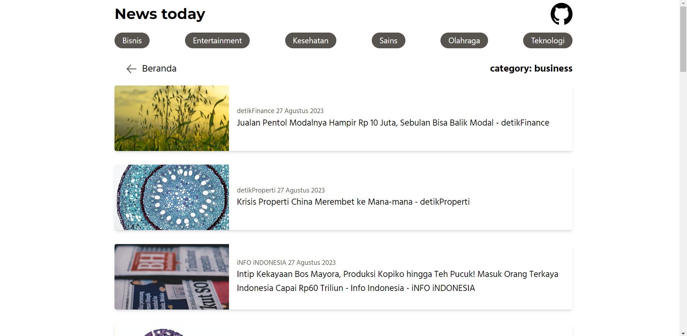

<p align="center"><strong>News Today - Website berita dengan integrasi News Api</strong></p>
<p align="center"><sub>express ejs tailwind <a href="newsapi.org">newsapi.org</a></sub></p>
<p align="center"><sub>Jangan lupa tekan 🌟</sub></p>

## Langkah untuk menggunakan News-Today

1. ```git clone https://github.com/insanXYZ/News-Today.git```
2. Daftar akun di newsapi.org untuk mendapatkan kunci API yang nantinya akan digunakan di file .env
3. ```cd News-Today```
4. ```npm install```
5. masuk ke file ```.env``` dan masukan kunci API yang sudah di dapatkan tadi ke properti NEWS_API_KEY
6. ```npm run start```
7. ```npx tailwindcss -i ./public/css/input.css -o ./public/css/output.css --watch```
8. Buka di browser url ```localhost:3000```